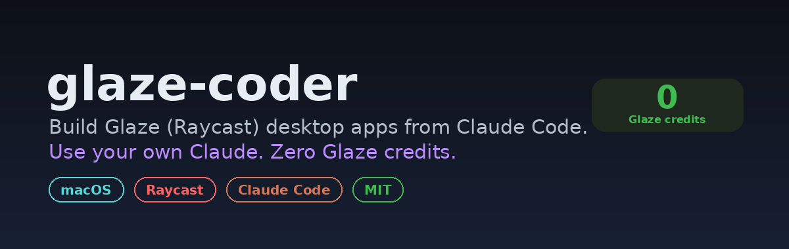
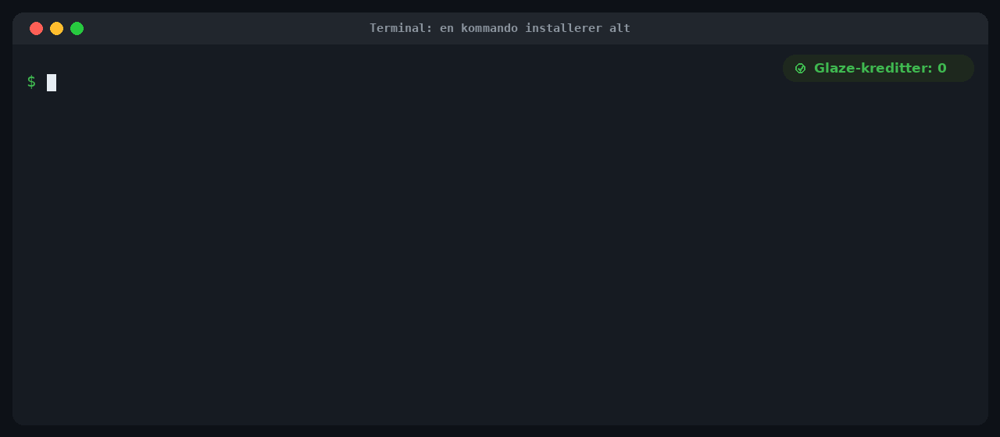
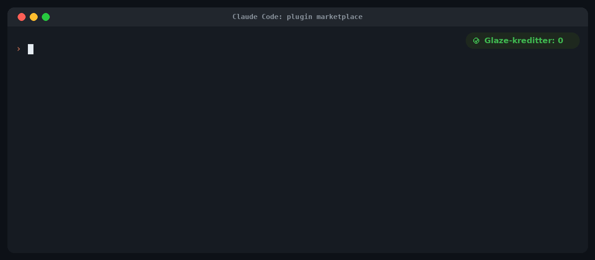
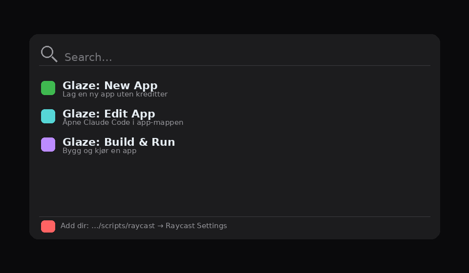

# glaze-coder

Build [Glaze](https://www.glaze.app) (by Raycast) desktop apps from Claude Code, using
your own Claude subscription instead of Glaze's paid credits.

Glaze builds Mac apps with a built-in AI agent, and that agent is what spends Glaze
credits. Every Glaze app is a normal project on disk, and Glaze
[supports editing the source yourself](https://manual.glaze.app/advanced/editing-code).
glaze-coder points your own Claude Code at that source and builds it locally with the
Node runtime Glaze already ships. Editing and building cost you nothing in Glaze credits.


## What you get

- A **skill** (`glaze-app-dev`) that gives Claude Code the Glaze project layout, the safety
  rules, and the local build and run loop. It also reads the guide and skills that ship
  with your own Glaze install, so it stays current with your version.
- A **command** (`/glaze-coder:glaze`) that lists your apps and starts building.
- A **launcher** (`glaze-dev`) for the terminal and Raycast, with commands to create,
  edit, build, run and remove apps.

## Requirements

- macOS (Tahoe or newer) on Apple Silicon, with Glaze installed and at least one app.
- [Claude Code](https://claude.com/product/claude-code) installed (`claude` on your PATH).

## Install

### Quick install (one command)

Paste this into a terminal. It clones the repo, links `glaze-dev` onto your PATH, links
Glaze's skills into `~/.claude`, and installs the Claude Code plugin if `claude` is
present. Nothing else to set up.

```bash
curl -fsSL https://raw.githubusercontent.com/GaimsDevSoftware/glaze-coder/main/install.sh | zsh
```



Then create your first app and jump straight into Claude Code:

```bash
glaze-dev start "Habit Tracker"
```

That is all most people need. The sections below show the individual methods if you
prefer to do it by hand.

### Claude Code plugin (manual)

The one-command installer already does this when `claude` is on your PATH. To do it
yourself from inside Claude Code:

```
/plugin marketplace add GaimsDevSoftware/glaze-coder
/plugin install glaze-coder
```



This gives you the `glaze-app-dev` skill and the `/glaze-coder:glaze` command. It works
the same whether you run Claude Code in a terminal or in the desktop app.

### Raycast (optional)

Raycast can only add a script folder from its own UI (there is no `raycast://` deeplink
to add a directory), so this is the one step that needs a click. Run:

```bash
glaze-dev raycast
```

That copies the folder path to your clipboard and opens Raycast. Then:

1. Raycast Settings, Extensions, Script Commands, Add Directories.
2. In the file picker press Cmd+Shift+G, paste, Enter, then Open.

You then get "Glaze: New App", "Glaze: Edit App" and "Glaze: Build & Run" in Raycast.



## Usage

```
glaze-dev start "My App"     Create a new app and open Claude Code in it
glaze-dev new   "My App"     Create a new app (no editor)
glaze-dev list               List your Glaze apps
glaze-dev code  <app>        Open Claude Code in an app's source
glaze-dev dev   <app>        Start the dev server (live reload)
glaze-dev build <app>        Build the app locally
glaze-dev run   <app>        Open the built app
glaze-dev br    <app>        Build then run
glaze-dev rm    <app>        Remove an app (bundle, source, profile)
```

`<app>` matches on the folder name or product name, so partial names work.

## How it works

A Glaze app lives in `~/Library/Application Support/app.glaze.macos.main/apps/<app>/`.
Inside, `.glaze-sources/` holds the editable source: a React and Vite renderer, a Node
backend, and a `package.json`. `npm run build` compiles it with the `@glaze/core` SDK and
the Node runtime that Glaze bundles, so no network call to Glaze happens and no credits
are used. The installed launcher in `/Applications/Glaze/<App>.app` finds the built code
through a symlink, which is how `glaze-dev new` can create a working app on its own.

## Notes

- Apps created by `new` and `start` are ad-hoc signed for your own use.
- Publishing to the public Glaze Store still needs a Glaze account, but publishing does
  not cost credits.
- Manual edits are not saved as entries in Glaze's version history. Make one small prompt
  to Glaze's agent if you want a checkpoint.
- You own your app and its code, so this is supported use of your own project.

## License

MIT
